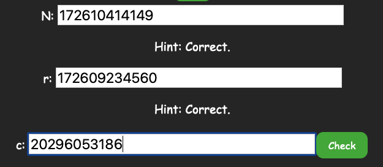

# Crypto Learning System User Guide

 

### What is Crypto Learning System

Crypto Learning System is an interactive learning system for people who wants to learn cryptography.  
Currently, three main cryptosystems are provided, RSA, Diffie-Hellman, and Elgamal. This web application is unique. Because it is not only providing generated results, it uses interactive learning tools and communicates with the user at each step. it is not only providing generated results. The user must input the correct number in each step to be able to reach the next step. We want users to understand and think with our step-by-step instructions, which can assist learning.  

### Usage
1. Select a cryptosystem you want to learn
 
2. Here we use RSA as example, You will see foldinng section: Method and Example
 
3. When you click on them, it will show more information 
They are instructions for RSA method with one example.
 
4. After you read through instructions, you can click [Yeah!] to go to the interactive section
 
5. Input numbers selected by yourself in the text box or 
 
You can click the dice, then we will provide valid numbers for you  
 
7. After input the numbers, click [Go!], and we will check if your numbers are usable or not
 
	- 
 

 

 

 

 

 

 

### Contributing

