# Crypto Learning System User Guide

<a href="https://crypto-learning-sys.herokuapp.com" class="image">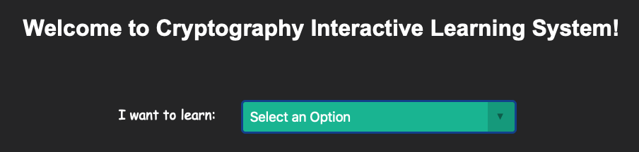</a> 

### What is Crypto Learning System

Crypto Learning System is an interactive learning system for people who wants to learn cryptography.  
Currently, three main cryptosystems are provided, RSA, Diffie-Hellman, and Elgamal. This web application is unique. Because it is not only providing generated results, it uses interactive learning tools and communicates with the user at each step. it is not only providing generated results. The user must input the correct number in each step to be able to reach the next step. We want users to understand and think with our step-by-step instructions, which can assist learning.  

### Usage
1. Select a cryptosystem you want to learn
<a href="https://crypto-learning-sys.herokuapp.com" class="image">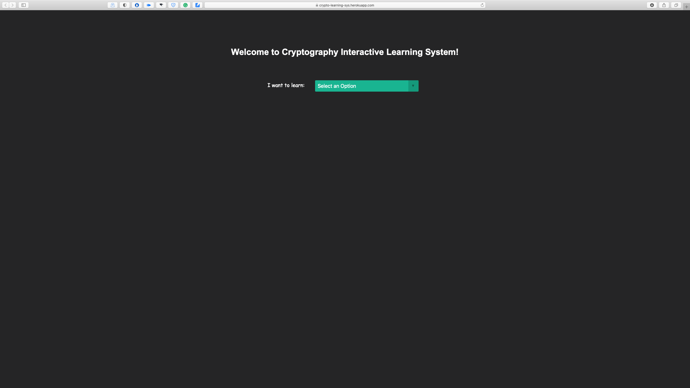</a> 
2. Here we use RSA as example, You will see foldinng section: Method and Example
<a href="https://crypto-learning-sys.herokuapp.com" class="image">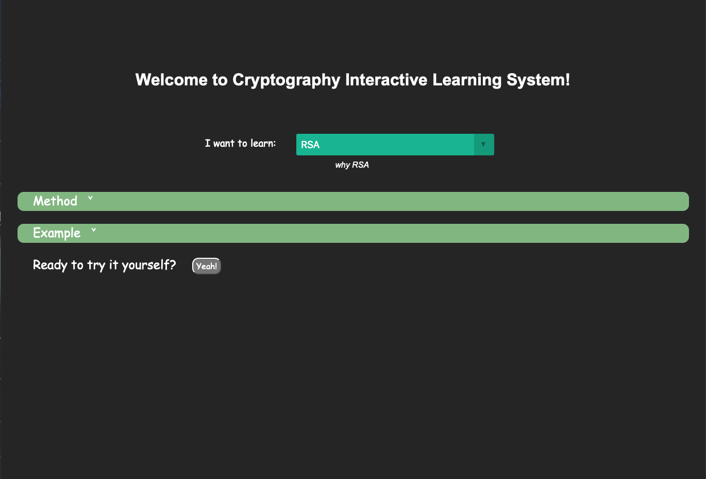</a> 
3. When you click on them, it will show more information 
They are instructions for RSA method with one example.
<a href="https://crypto-learning-sys.herokuapp.com" class="image">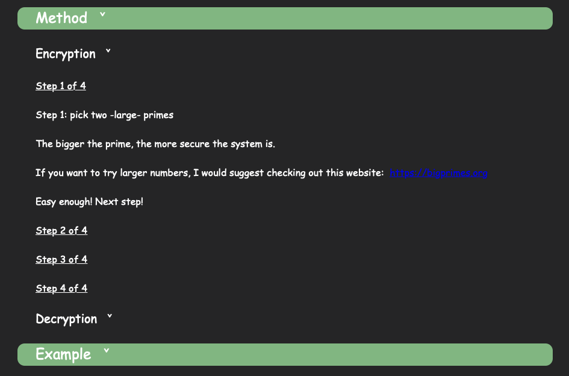</a> 
4. After you read through instructions, you can click [Yeah!] to go to the interactive section 
	Key Creation Section  
 
5. Input numbers selected by yourself in the text box or You can also click 🎲, we will generate valid numbers for you 
<a href="https://crypto-learning-sys.herokuapp.com" class="image">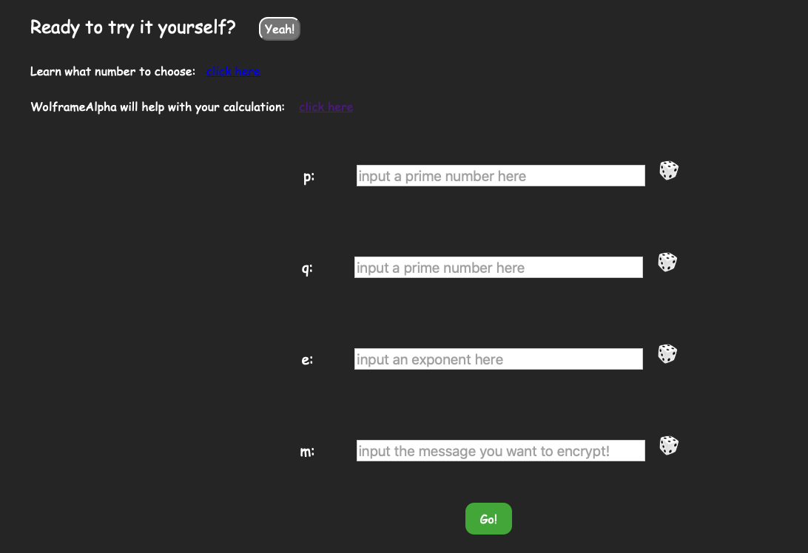</a> 
6. After input the numbers, click [Go!], and we will check if your numbers are usable or not
<a href="https://crypto-learning-sys.herokuapp.com" class="image">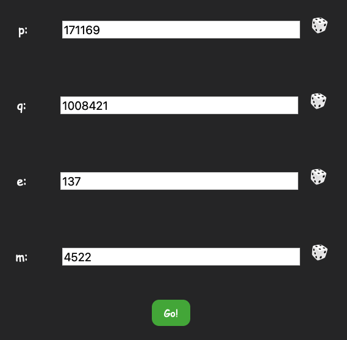</a> 
	- If your number is not valid, a hint will popup to show which number is having problem
	<a href="https://crypto-learning-sys.herokuapp.com" class="image">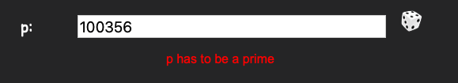</a> 
	- Else, next section (Encryption section) will show up
	<a href="https://crypto-learning-sys.herokuapp.com" class="image">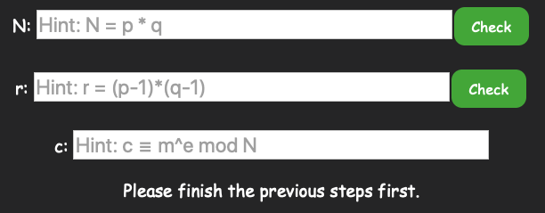</a> 
7. Start **Encryption**!  
Calculate the numbers with provided hint, input in the text box, and click [Check]  
	- If your calculated result is incorrect, the following Hint will jump out
	<a href="https://crypto-learning-sys.herokuapp.com" class="image">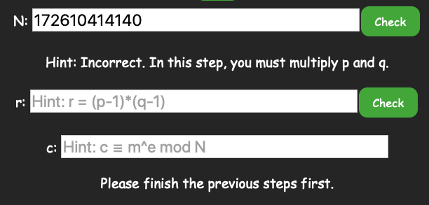</a> 
	- Otherwise, you will see **Correct**
	<a href="https://crypto-learning-sys.herokuapp.com" class="image">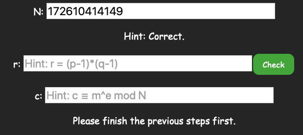</a> 
8. Once you finished the encryption section with correct answers, you are eligible to go to the next section: Decryption Section
<a href="https://crypto-learning-sys.herokuapp.com" class="image">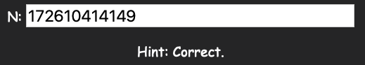</a> 
9. Start **Decryption**!  
Calculate the numbers with provided hint, input in the text box, and click [Check]  
<a href="https://crypto-learning-sys.herokuapp.com" class="image">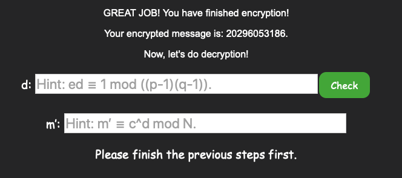</a> 
- If your calculated result is incorrect, the following Hint will jump out
	<a href="https://crypto-learning-sys.herokuapp.com" class="image">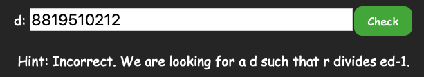</a> 
	- Otherwise, you will see **Correct**
	<a href="https://crypto-learning-sys.herokuapp.com" class="image">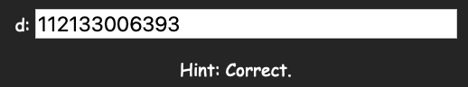</a> 
10. Once you finished these two, you will see a message: "You will find out m’ is the same as your inputted message m!" 
**Now you're done! 😊** 
<a href="https://crypto-learning-sys.herokuapp.com" class="image">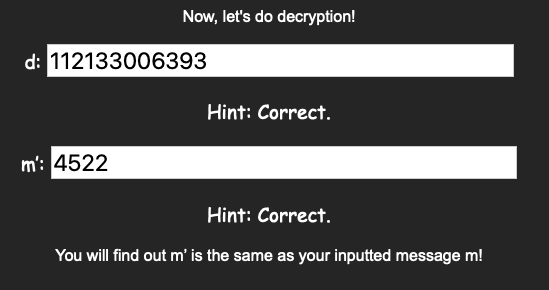</a> 

### Contributing

