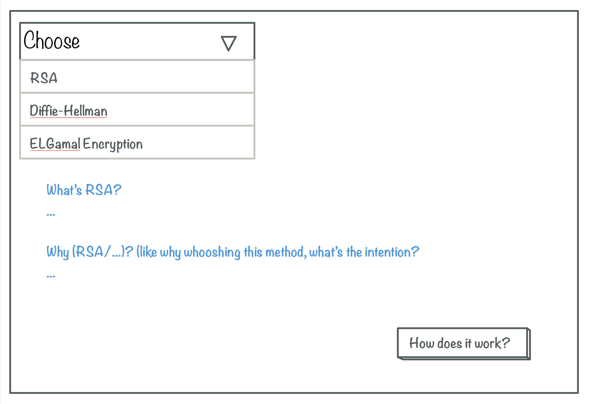
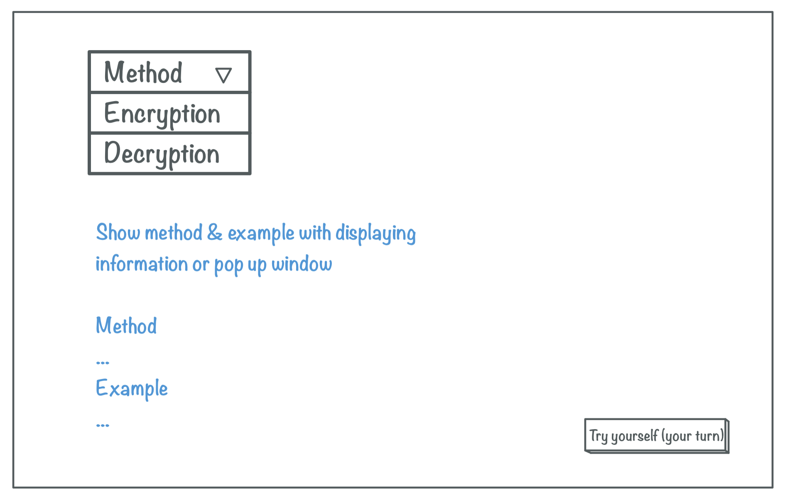
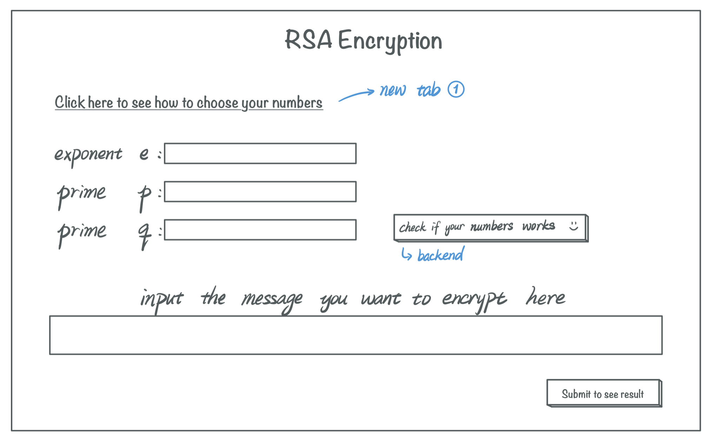
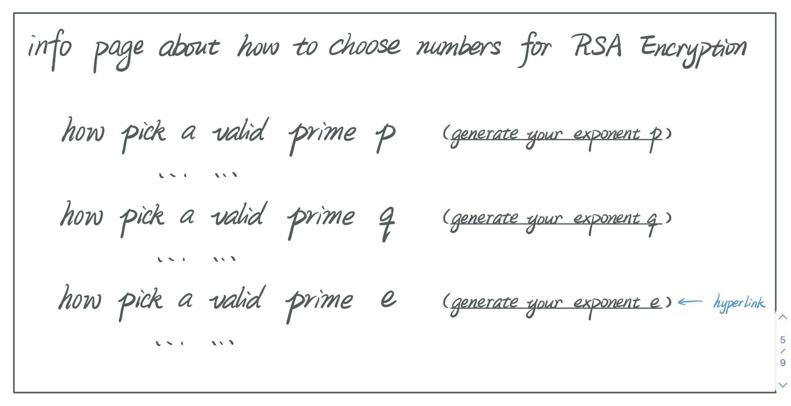

# Meeting Schedules:
* Monday: 4pm - 6pm
* Friday: 11am - 1pm
* Saturday as needed
---

## Meetings:
1. [10/28 W: ALL members](https://github.com/missystem/crypto_learning_sys/blob/master/meeting.md#1028-w-all-members)
2. [10/29 U: Donna & Missy](https://github.com/missystem/crypto_learning_sys/blob/master/meeting.md#1029-u-donna--missy)
3. [10/30 F: ALL members](https://github.com/missystem/crypto_learning_sys/blob/master/meeting.md#1030-f-all-members)
4. [11/02 M: ALL members](https://github.com/missystem/crypto_learning_sys/blob/master/meeting.md#1102-m-all-members)
---

## Separate this project into 3 sections:
1. Front end (JAVA script - JQuery)
	- detailed solution page
2. Middle part (html, flask)
	- initial page
	- "just show result"
3. Back end (python code - crypto algorithm)
	- Look into cryptosys and find the desired variables that are needed for encryption/decryption

---

## Group Members: Donna Hooshmand, Xuehai Zhou, John Zhou, Missy Shi
* **Donna**: Documentations (meetings & Schedule)
* **John**: Documentations
* **Xuehai**: Tester
* **Missy**: Repo manager

---

### 10/28 W: ALL members
* Task Assignments:
	* Java Script & Jquery:
		- John
	* html & flask:
		- Xuehai
		- Donna
	* Python
		- Missy
		- Donna

* Website pages:
	1. Initial Page:
		1. Welcome message + Product info + User manual
		2. Select cryptosystem
		3. encrypt/decrypt
	2. Give the variables related to the cryptosystem (different versions based on the cryptosystem)
	3. Interactive page

* TODO (until Friday)
	- Find cryptosystems to do and give info on them - Donna & Missy
		- How many? Which one?
	 	- Give variables we would need on the webpage
	- Learn Flask & html - Xuehai & Donna
	- Create a temporary timeline for project - Donna
	- Learn JavaScript and Jquery - John

---

### 10/29 U: Donna & Missy

* Which Cryptosystems to use:   
	*(?) = undecided, if have time*  
	- [Intro to Math Cryptography](https://github.com/missystem/crypto_learning_sys/blob/master/intro%20to%20math%20crypto.pdf)
	1. [RSA (cryptosystem)](https://en.wikipedia.org/wiki/RSA_(cryptosystem))   
	  
	2. [Diffie–Hellman key exchange](https://en.wikipedia.org/wiki/Diffie–Hellman_key_exchange)   
	[example](https://medium.com/@sadatnazrul/diffie-hellman-key-exchange-explained-python-8d67c378701c)    
	  
	3. [ElGamal encryption](https://en.wikipedia.org/wiki/ElGamal_encryption) 
	  
	4. [Pohlig-Hellman Algorithm](https://en.wikipedia.org/wiki/Pohlig–Hellman_algorithm) (?)
	5. [Vigenere Cipher](https://en.wikipedia.org/wiki/Vigenère_cipher) (?)    
	  
	6. [Substitution Cipher](https://en.wikipedia.org/wiki/Substitution_cipher) (?)
	7. [Data Encryption Standard (DES)](https://en.wikipedia.org/wiki/Data_Encryption_Standard) (?)
	8. [Advanced Encryption Standard (AES)](https://en.wikipedia.org/wiki/Advanced_Encryption_Standard) (?)

---

### 10/30 F: ALL members
* Present the cryptosystems
* Clarify each module and the job of each individual
	- Xuehai & Donna : html and flask
	- Missy & Donna : Backend
		- How will it look:
			- Each cryptosystem will have it's own .py file with functions, such as step1, step2, etc.
	- John : Interactive page
* Rough Timeline:
	- RSA cryptosystem done by 11/08 Sunday
	- Diffie-Hellman key exchange & ElGamal encryption (11/18 Wed)
	- Add other cryptosystems (11/25 Wed)
	- Make sure everything works and final changes (11/29 Sun)
* Ask Prof. Young if the project is good.
* Clarify the deadline with Prof. Young.

---

### 11/02 M: ALL members
* Present progress:
	- John: Finished most of the framework. He presented some issues and warned us to be cautious of using ajax. 
		- For python module: We need to use a json data structure to return the inputs in the main python function of each file.
		- For the html/flask (with some help from the java module): We need to figure out cookies and ajax calling-function (double checked with Michal)
	- Xuehai: Finished the initial page with the cryptosystems and created the skeleton for all cryptosystems input pages. 
	- Missy and Donna: Will need to change the output to be a json file and also we need to have a main function in constrast to only creating a library with stepX functions. 
	
* Changes:
	- After the initial page, make a method page, and then use a botton like "try it yourself" to go to the input page (create new tab for the input page). 
	- Change backend output to a json file
* Scratch for front end design    
	- Choose a method -> show what is this method, and motivation.
	 
	- [new page] -> how encryption/ work when select encryption/decryption
	 
	- on the method page: also show how to choose input numbers for encryption
	 
	- [new tab] -> input page
		- check if numbers work |-> backend -> isPrime/
		- |-> if numbers do not work -> popup window to show which number isn't working
		- |-> if numbers work -> encryption/decryption
	 
	- [same page] -> encryption: show step-by-step with [click to see next step]
	 
			
